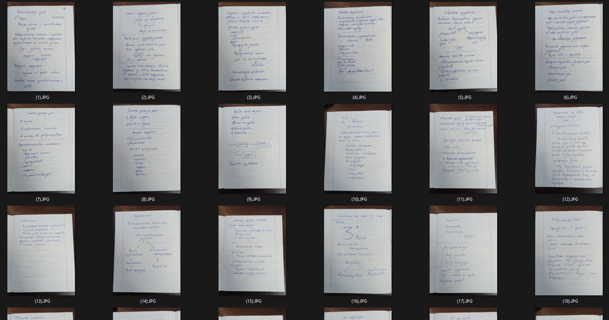
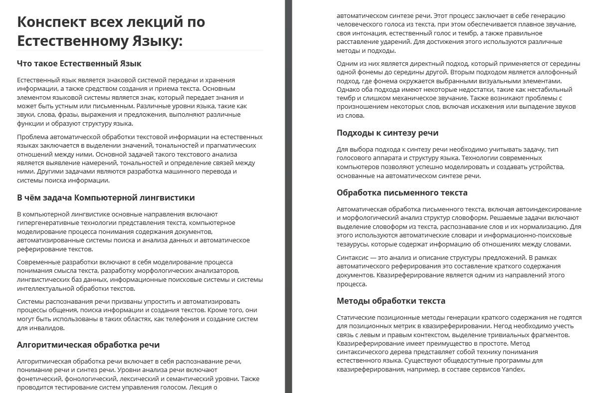

### Проект распознавания рукописного текста

По одному предмету я весь семестр вёл конспекты лекций. Торопился, иногда записывал криво, и косо. А также, бывало рисовал рисунки в тетрадке - всё равно это был не самый важный предмет

А в конце семестра мне пришла в голову идея - сделать из этого всего конспект в электронном виде

---

Распознать печатный текст - это одно дело  
Но задача была в том, что бы распознать рукописный текст, а таких инструментов практически нет, и их можно пересчитать по пальцам одной руки

Однако, я нашёл инструменты, а точнее один. Сервис https://rehand.ru

Он умеет распознавать текст с фотографий, и делает это настолько хорошо, что распознаёт даже зачёркнутые слова))

---

Далее, я получил текст, но в нём была куча грамматических и синтаксических ошибок. И мне, разумеется не хотелось с этим всем возиться

И тогда мне на помощь пришёл другой инструмент, по обработке текста: https://nicebot.ru/rerait-teksta-neirosetiy

Он смог моментально исправить все ошибки, и дальше улучшить текст, сделав его более читаемым и приятным для глаз

---

#### Что получилось в итоге:

Вот начальные фото конспекта:

И вот финальный результат:

